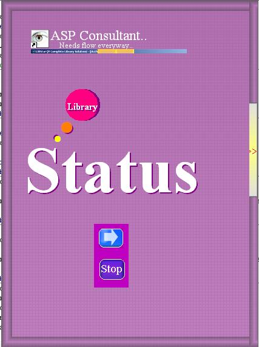



## ALL IN ONE\(ENCRIPTION, DATA BASE EASY CONNECTION,NEW FORM LOOK\)

### Description

1.its new form drag-drop concept.

2.MS ACCESS data base connection through ADODB without used any control.

3.User ID and Password store in encrited form or say that well concept of encode and decode.

4.change user id and password.

5.create users. and more things
 
### More Info
 
Admin id: amit

password: amit

please add refrence-Microsoft activex data object Library 2.1

return satisfaction

             |
---                |---
**Submitted On**   |2008-04-13 21:27:30
**By**             |[amit pandey](https://github.com/Planet-Source-Code/PSCIndex/blob/master/ByAuthor/amit-pandey.md)
**Level**          |Intermediate
**User Rating**    |5.0 (10 globes from 2 users)
**Compatibility**  |VB 6\.0
**Category**       |[Complete Applications](https://github.com/Planet-Source-Code/PSCIndex/blob/master/ByCategory/complete-applications__1-27.md)
**World**          |[Visual Basic](https://github.com/Planet-Source-Code/PSCIndex/blob/master/ByWorld/visual-basic.md)
**Archive File**   |[ALL\_IN\_ONE2109644152008\.zip](https://github.com/Planet-Source-Code/amit-pandey-all-in-one-encription-data-base-easy-connection-new-form-look__1-70418/archive/master.zip)

